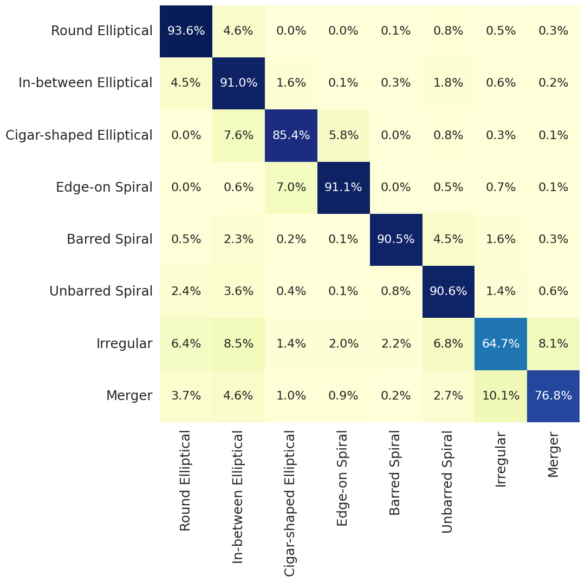

# Galaxy Morphological Classification with Vision Transformers

Reproduction study of Vision Transformers (ViTs) for galaxy morphology classification using the Galaxy Zoo 2 dataset.

## Key Features
- Achieves **89.84%** test accuracy in just **10 epochs**
- Implements efficient fine-tuning of pretrained ViT models
- Handles class imbalance through weighted loss functions
- Full reproducibility pipeline for astronomical ML research

## Table of Contents
- [Dataset](#dataset)
- [Training](#training)
- [Results](#results)
- [Future Work](#future-work)
- [Contributing](#contributing)

## Dataset

Uses the [Galaxy Zoo 2 Dataset](https://data.galaxyzoo.org/) containing:
- 247,437 SDSS galaxy images
- 8 morphological classes:
  - Round Elliptical
  - In-between Elliptical
  - Cigar-shaped Elliptical  
  - Edge-on Spiral
  - Barred Spiral
  - Unbarred Spiral
  - Irregular
  - Merger

Preprocessing follows Willett et al.'s pipeline with 224×224px resolution.

## Results

### Performance Metrics

| Class                | Accuracy (%) | F1 Score |
|----------------------|--------------|----------|
| Barred Spiral        | 90.54        | 0.89     |
| Merger               | 76.77        | 0.73     |
| **Overall Accuracy** | **89.84**    | -        |

Full comparison with original study:

| Metric         | Original | This Work |
|----------------|----------|-----------|
| Training Epochs| 200      | 10        |
| Params (M)     | 86       | 86        |
| Top-1 Accuracy | 85.0%    | 89.84%    |

## Future Work
- Implement progressive attention sampling
- Develop hybrid CNN-Transformer architectures
- Cross-survey domain adaptation for LSST data 

**Related Papers**  
[Full Project Report](Final_report_GMC_EP22BTECH11026.pdf) | [Original ViT Paper](https://arxiv.org/abs/2010.11929) | [Galaxy Zoo 2 Dataset Paper](https://arxiv.org/abs/1308.3496)
